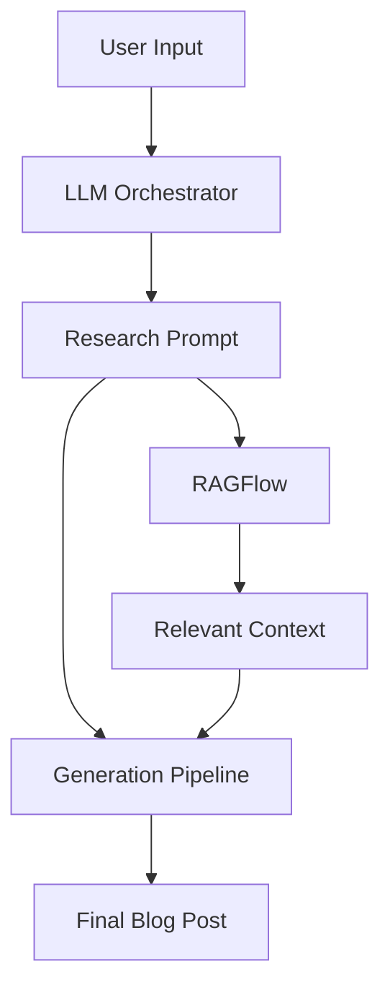

# LLM Orchestra: Harmonizing Multiple AI Models for Enhanced Content Generation

## Project Overview

LLM Orchestra is an innovative content generation system that combines the strengths of multiple Large Language Models (LLMs) with Retrieval-Augmented Generation (RAG) to produce high-quality, fact-verified blog content. The system orchestrates GPT-4, Claude, and Gemini in a harmonious workflow, each model contributing its unique capabilities to the final output.

## System Architecture

The system is built on three primary layers that work in concert:

### 1. LLM Orchestrator Layer

This layer acts as the conductor, coordinating different AI models for optimal content generation:

- **GPT-4 (OpenAI)**: Handles primary content structure and generation
- **Claude (Anthropic)**: Specializes in research analysis and citation generation
- **Gemini (Google)**: Focuses on fact verification and alternative perspectives

The orchestrator intelligently routes tasks to each model based on their strengths, ensuring a comprehensive and balanced output.

### 2. RAGFlow Integration Layer

A sophisticated retrieval system that enhances content with factual context:

- **Vector Database**: Stores and indexes research data in a Docker container
- **Search Processor**: Converts user prompts into vector embeddings
- **Context Retriever**: Ranks and filters relevant content
- **Citation Manager**: Formats and validates references

### 3. Blog Generation Pipeline

A four-stage process ensuring high-quality content:

#### Research & Planning
- Processes research prompts from LLMs
- Retrieves relevant context from RAG
- Develops comprehensive content outlines

#### Content Generation
- Utilizes primary LLM for initial draft
- Incorporates RAG-retrieved context
- Maintains fact accuracy through verification

#### Refinement
- Employs secondary LLMs for content review
- Formats citations consistently
- Adjusts style and tone for target audience

#### Quality Assurance
- Performs thorough fact verification
- Validates all citations
- Ensures style consistency
- Applies final formatting

## Technical Implementation

### Data Flow

### Key Integration Points

1. **LLM Orchestrator ↔ RAGFlow**
   - Handles research phase coordination
   - Manages prompt routing and context integration

2. **RAGFlow ↔ Generation Pipeline**
   - Ensures content verification
   - Maintains citation accuracy

3. **Generation Pipeline ↔ LLM Orchestrator**
   - Manages content refinement workflow
   - Coordinates model-specific tasks

## Development Status

The project is currently in active development with the following milestones:

- Architecture design and planning
- LLM integration framework
- RAG system prototype
- Pipeline orchestration
- Docker containerization
- Testing and validation
- Production deployment

## Future Roadmap

1. **Enhanced Model Integration**
   - Support for additional LLM providers
   - Advanced model routing algorithms
   - Custom model fine-tuning options

2. **RAG Improvements**
   - Expanded knowledge base
   - Real-time source verification
   - Advanced citation management

3. **System Optimization**
   - Enhanced parallel processing
   - Automated scaling capabilities
   - Performance monitoring tools

4. **User Experience**
   - Web-based control interface
   - Real-time generation progress
   - Custom content templates

## Impact

This system represents a significant advancement in content generation by:

1. Combining multiple LLMs for enhanced quality
2. Ensuring factual accuracy through RAG
3. Automating complex content workflows
4. Providing scalable content generation
5. Maintaining consistent quality standards

## Getting Started

The system is designed for easy deployment using Docker containers. Full documentation and setup instructions will be available upon initial release.

## Contributing

The project is currently in private development. Contribution guidelines will be provided when the project moves to a more open development model.

## License

This project is licensed under the MIT License. See the LICENSE file in the repository for details.
